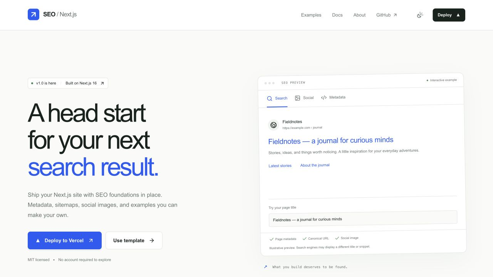

# SEO Next.js 启动模板

[](README-zh.md)
[](README.md)

[![GitHub][GitHub]][GitHub URL]
[![GitHub stars][Stars]][Stars URL]
[![GitHub forks][Forks]][Forks URL]
[![GitHub issues][Issues]][Issues URL]
[![GitHub license][License]][License URL]
[![Last Commit][Last Commit]][Last Commit URL]

[![use this template][Use This Template]][Use This Template URL]

[![Deploy with Vercel][Deploy with Vercel]][Deploy with Vercel URL]

为你的下一个搜索结果打好基础。一个开源 Next.js 启动模板，内置页面元数据、站点地图、社交分享图，以及可检查、可修改的实用示例。

[在线演示](https://seo-nextjs.alin.run) · [中文文档](https://seo-nextjs.alin.run/docs/zh) · [示例](https://seo-nextjs.alin.run/examples) · [Vercel 模板](https://vercel.com/templates/next.js/seo-starter)

[](https://seo-nextjs.alin.run)

## v1 包含什么

- **逐页 SEO：** 通过一个 metadata helper 生成标题、描述、canonical、Open Graph 和 Twitter 分享卡。
- **区分生产环境的索引策略：** 按路由生成 sitemap、robots，本地和 Preview 使用 noindex，并明确配置生产域名。
- **动态社交图片：** 使用 `next/og` 生成 1200 × 630 PNG，并提供配套图标。
- **可检查的示例：** 带静态文章和动态 metadata 的内容站，以及带可操作上线检查表的产品页。
- **结构化数据：** WebSite、SoftwareSourceCode、Article、BreadcrumbList 示例，JSON-LD 输出经过转义。
- **双语文档：** 英文与中文独立路由、双向 hreflang、旧 README 路由重定向和易读代码块。
- **响应式设计：** 深浅色主题、键盘导航、交互式 SEO 预览及作者项目卡片。
- **可重复检查：** GitHub Actions 执行 ESLint、TypeScript、Node 测试、生产构建和 HTTP SEO 断言。

采用 **Next.js 16、React 19、TypeScript 5、Tailwind CSS 4、Node.js 22 和 pnpm 11**。模板提供 SEO 基础配置，不承诺搜索排名或某个性能分数。

## 快速开始

点击上方 **Use this template** 创建自己的仓库，再克隆新仓库：

```bash
# 使用 Node.js 22.x；尚未安装 pnpm 时执行第一行
npm install --global pnpm@11.24.0
pnpm install --frozen-lockfile
cp .env.example .env.local
pnpm dev
```

打开 [localhost:3000](http://localhost:3000)。运行示例不需要账号、数据库或分析服务。

## 站点配置

本地写入 `.env.local`，生产环境在部署平台设置：

```dotenv
NEXT_PUBLIC_SITE_NAME="你的网站"
NEXT_PUBLIC_TITLE="你的页面标题"
NEXT_PUBLIC_DESCRIPTION="准确说明网站内容的一段描述。"
NEXT_PUBLIC_URL="https://example.com"
# 可选：设为 false 关闭索引
# NEXT_PUBLIC_INDEXABLE="false"
# 可选：你自己的 GA ID；不设置则不加载分析
# NEXT_PUBLIC_GOOGLE_ANALYTICS_ID="G-XXXXXXXXXX"
```

`NEXT_PUBLIC_URL` 必须是 HTTP(S) origin，不能带路径、查询参数或账号密码。公开发布前配置真实生产域名。省略时，Vercel 部署使用自己的项目域名；本地默认 `http://localhost:3000`。即使配置了正式域名，Preview 仍然使用 noindex。noindex 页面允许抓取，以便爬虫读取该指令。

在页面的服务端组件中设置 metadata：

```tsx
import { pageMetadata } from "@/lib/seo";

export const metadata = pageMetadata(
  "关于我们",
  "/about",
  "了解这个网站背后的团队与想法。",
);
```

新增或删除页面时，同步维护 `src/app/sitemap.ts`。根据自己的项目修改 `src/config.ts`、示例与作者卡片。首页预览仅用于演示；搜索引擎可能重写标题和摘要。

## 部署到 Vercel

[![使用 Vercel 部署][Deploy with Vercel]][Deploy with Vercel URL]

1. 点击按钮创建自己的仓库与 Vercel 项目。
2. 将 `NEXT_PUBLIC_URL` 设置为生产 origin，修改站名、标题与描述。使用自定义域名时，先在 Vercel 添加域名。
3. 部署后检查 `/sitemap.xml`、`/robots.txt` 和 `/api/og`，并查看 HTML 中的 canonical 与分享标签。
4. 环境变量更改后重新部署。Preview 保持 noindex；不要把演示站的域名或分析 ID 复制到自己的项目。

维护中的演示站是 [seo-nextjs.alin.run](https://seo-nextjs.alin.run)，原有 [Vercel 演示地址](https://seo-nextjs-starter.vercel.app) 同样保留。[模板收录页](https://vercel.com/templates/next.js/seo-starter) 的维护独立于 Git 自动部署。

## 检查修改

```bash
pnpm check        # lint、路由类型、TypeScript、测试、生产构建
pnpm start        # 在第二个终端启动
pnpm test:seo     # 检查 localhost:3000 的真实 HTTP 响应
# 可选：SEO_CHECK_URL=https://your-site.com pnpm test:seo
```

HTTP 检查覆盖示例路由、canonical、分享信息、双语文档关联、sitemap/robots、PNG 资源、重定向、404 和内置作者外链。定制模板后，相应调整路由与作者链接断言。从 0.2.x 升级请阅读[迁移说明](MIGRATION.md)及[更新日志](CHANGELOG.md)。

## 文件导航

| 路径                              | 用途                          |
| --------------------------------- | ----------------------------- |
| `src/config.ts`                   | 站点身份及 URL 解析           |
| `src/lib/seo.ts`                  | 逐页 metadata 与面包屑 helper |
| `src/app/sitemap.ts`、`robots.ts` | 页面发现与索引策略            |
| `src/app/api/og/route.tsx`        | 动态分享 PNG                  |
| `src/content/articles.ts`         | 文章示例内容                  |
| `src/content/docs.*.md`           | 双语网站文档                  |
| `tests/`、`scripts/check-seo.mjs` | 配置与 HTTP 检查              |

## 作者的其他项目

[Leo Wang](https://alin.run) 的其他工具与创作项目：

- [Toolbox Hub](https://toolbox-hub.com) — 免费在线工具。
- [H3Run](https://h3run.com) — AI 视频创作。
- [H3MaxLive](https://h3maxlive.com) — 互动 AI 视频。
- [Image 2.5](https://image-2-5.com) — AI 图片创作与编辑。

这里展示作者项目，不代表这些项目使用了本模板。你可以在自己的网站中删除或替换展示区；按 MIT 许可要求保留版权与许可声明即可。

## 分享你的作品

使用本模板做了项目？欢迎[提交网站](https://github.com/wangrunlin/seo-nextjs-starter/issues/new?template=submit-website.yml)或[报告问题](https://github.com/wangrunlin/seo-nextjs-starter/issues)。欢迎贡献，请运行检查并保持改动聚焦。本公开仓库的提交信息延续英文 Conventional Commits 风格。

## 许可

[MIT](LICENSE)。可自由使用、修改并在此基础上构建。

[Stars]: https://img.shields.io/github/stars/wangrunlin/seo-nextjs-starter?style=for-the-badge
[Stars URL]: https://github.com/wangrunlin/seo-nextjs-starter/stargazers
[Forks]: https://img.shields.io/github/forks/wangrunlin/seo-nextjs-starter?style=for-the-badge
[Forks URL]: https://github.com/wangrunlin/seo-nextjs-starter/forks
[Issues]: https://img.shields.io/github/issues/wangrunlin/seo-nextjs-starter?style=for-the-badge
[Issues URL]: https://github.com/wangrunlin/seo-nextjs-starter/issues
[License]: https://img.shields.io/github/license/wangrunlin/seo-nextjs-starter?style=for-the-badge
[License URL]: https://github.com/wangrunlin/seo-nextjs-starter/blob/main/LICENSE
[Last Commit]: https://img.shields.io/github/last-commit/wangrunlin/seo-nextjs-starter?style=for-the-badge
[Last Commit URL]: https://github.com/wangrunlin/seo-nextjs-starter/commits/main
[GitHub]: https://img.shields.io/badge/GitHub-wangrunlin%2Fseo--nextjs--starter-blue?style=for-the-badge&logo=github
[GitHub URL]: https://github.com/wangrunlin/seo-nextjs-starter
[Use This Template]: https://img.shields.io/badge/Use_this_template-Click_here-brightgreen?style=for-the-badge
[Use This Template URL]: https://github.com/new?template_name=seo-nextjs-starter&template_owner=wangrunlin
[Deploy with Vercel]: https://vercel.com/button
[Deploy with Vercel URL]: https://vercel.com/new/clone?repository-url=https%3A%2F%2Fgithub.com%2Fwangrunlin%2Fseo-nextjs-starter&env=NEXT_PUBLIC_URL
[Preview URL]: https://seo-nextjs.alin.run/
[Vercel Environment Variables]: https://vercel.com/docs/projects/environment-variables
[Next.js Metadata Documentation]: https://nextjs.org/docs/app/api-reference/file-conventions/metadata
[Open Graph Image Generation Documentation]: https://vercel.com/docs/functions/og-image-generation
[Ahrefs SEO Guide]: https://ahrefs.com/seo
